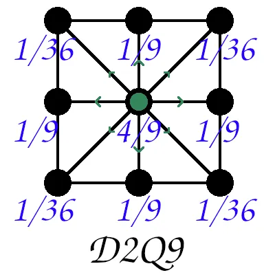
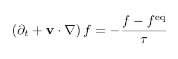
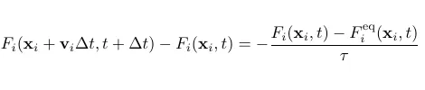
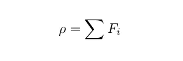
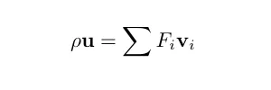
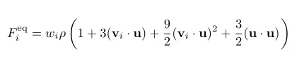
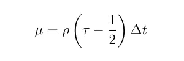

# Symulacja procesu wentylacji powietrza w pomieszczeniach

Projekt z przedmiotu Fizyka Ogólna [FO] w semestrze 2024Z.

Skład zespołu:
- Marcin Sikorski
- Maciej Dobrowolski

## Opis
Program symuluje dynamikę przepływu powietrza w środowisku 2D za pomocą metody Lattice Boltzmann (LBM). Symulacja odbywa się na mapie zdefiniowaniej w pliku JSON, którą można utworzyć za pomocą dedykowanego edytora. Mapa określa układ środowiska, w tym przeszkody i otwarte przestrzenie. Można również określić początkowy przepływ powietrza. Wizualizacja wyników pokazuje pole prędkości przepływu powietrza w czasie.

## Uruchomienie projektu

Przed uruchomieniem projektu zalecane jest stworzenie środowiska wirtualnego za pomocą komendy:
```bash
    python -m venv venv
```
Następnie należy aktywować środowisko:
```bash
    # Windows
    venv\Scripts\activate

    # Linux / Mac
    source venv/bin/activate
```
Kolejnym krokiem jest zainstalowanie niezbędnych pakietów do uruchomienia symulacji:
```bash
    pip install -r requirements.txt
```
Uruchom za pomocą pythona plik _interface.py_
```bash
    python interface.py
```
W konsoli uruchomi się interfejs potrzebny do uruchomienia symulacji.

## Interfejs
Interfejs wygląda w nastepujący sposób
```bash
    1. Start simulation.
    2. Level editor.
    3. Simulation options
    q. Exit.
    Your choice:
```
Mamy do wyboru następujące opcje:
1. Rozpoczyna symulację z aktualnie ustawionymi parametrami. Umożliwia przed rozpoczęciem wybór mapy.
2. Uruchamia edytor map.
3. Umożliwia zmianę parametrów symulacji.

### Sterowanie edytorem map
W celu tworzenia mapy wybieramy myszką typy bloków w lewym górnym rogu okna i umieszczamy je na planszy.
- __b__ - chowa pasek wyboru typu bloku
- __s__ - umożliwia zapis mapy, __ESC__ - anuluje operację, __ENTER__ zapisuje mapę.

Mamy kilka możliwych bloków:
- blok biały - pusta przestrzeń
- blok czarny - przeszkoda
- blok zielony - wnętrze pomieszczenia (nieużywane, może posłużyć w kodzie do zdefiniowania innych warunków początkowych)
- strzałki - stymulują ruch powietrza w danym kierunku

## Opis modelu symulacji

W każdym węźle siatki znajduje się 9 kierunków prędkości. Są 4 połączenia: w górę, dół, lewo, i prawo, 4 połączenia po przekątnych oraz 1 połączenie reprezentujące zerową prędkość. Każdy węzeł siatki ma przypisaną wagę ω<sub>i</sub>



Mikroskopowe cząstki tworzące płyn można opisać za pomocą funkcji rozkładu _f(x,v)_, która opisuje gęstość przestrzeni fazowej płynu w lokalizacji x poruszając się z prędkością _v_.
Cząstki przepływają i zderzają się. Zachowanie może być uchwycone za pomocą aproksymacji BGK (Bhatnagar–Gross–Krook):



W tej aproksymacji _τ_ jest skalą czasową, w której zachodzą zderzenia, a funkcja rozkładu _f_ dąży do pewnego stanu równowagi _f<sup>eq</sup>_.

Równanie można zdyskretyzować na siatce w następujący sposób:



### Momenty funkcji rozkładu
__Gęstość__:



__Pęd__



### Zderzenia

Definiujemy stan równowagi w wyniku zderzeń. Zakładamy płyn o stałej temperaturze, który ma stałą prędkość dźwięku. Jednostki zdefiniowane są tak, że prędkość na siatce wynosi _c = 1_.



Co odpowiada równaniom Naviera-Stokesa dla płynu izotermicznego o dynamicznej lepkości:



### Warunki brzegowe
W miejscach przeszkód cząstki zachowują się inaczej. Cząstki odbijają się, więc po prostu zmieniamy kierunki siatki.


Dodatkowo granice mapy zostały ustawione na absorbujące. Żeby uniknąć "teleportacji" cząsteczek na drugą stronę mapy, parametry krańcowych cząsteczek zostają ustawione na równe cząsteczkom, które je poprzedzają.


## Źródła
https://medium.com/swlh/create-your-own-lattice-boltzmann-simulation-with-python-8759e8b53b1c